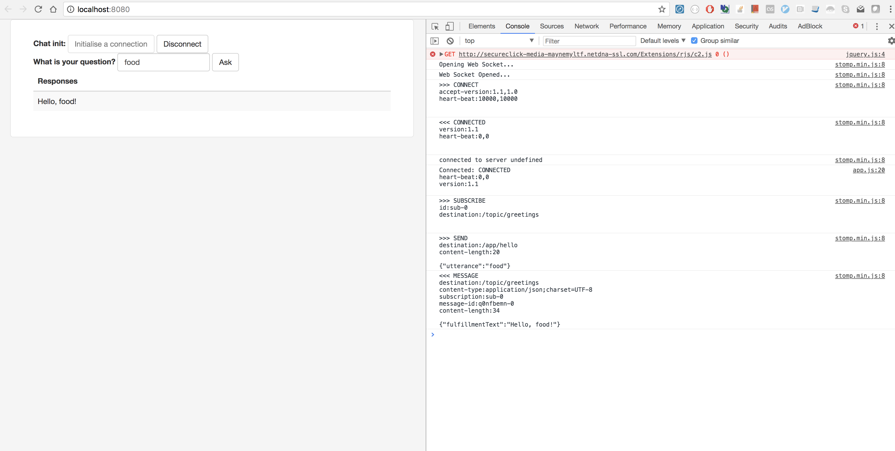

chat server with WS
-------------------

http://jmesnil.net/stomp-websocket/doc/

The WebSocket API enables web applications to handle bidirectional communications with server-side process in a straightforward way. Developers have been using XMLHttpRequest ("XHR") for such purposes, but XHR makes developing web applications that communicate back and forth to the server unnecessarily complex. XHR is basically asynchronous HTTP, and because you need to use a tricky technique like long-hanging GET for sending data from the server to the browser, simple tasks rapidly become complex. As opposed to XMLHttpRequest, WebSockets provide a real bidirectional communication channel in your browser. Once you get a WebSocket connection, you can send data from browser to server by calling a send() method, and receive data from server to browser by an onmessage event handler.

```
mvn spring-boot:run
```

on request,

```
2018-05-06 19:27:20.561  INFO 54728 --- [nboundChannel-7] com.chat.server.ChatEndpoint             : received chat request: com.chat.server.schema.ChatRequest@4385ec87
2018-05-06 19:27:46.144  INFO 54728 --- [MessageBroker-4] o.s.w.s.c.WebSocketMessageBrokerStats    : WebSocketSession[1 current WS(1)-HttpStream(0)-HttpPoll(0), 1 total, 0 closed abnormally (0 connect failure, 0 send limit, 0 transport error)], stompSubProtocol[processed CONNECT(1)-CONNECTED(1)-DISCONNECT(0)], stompBrokerRelay[null], inboundChannel[pool size = 9, active threads = 0, queued tasks = 0, completed tasks = 9], outboundChannelpool size = 2, active threads = 0, queued tasks = 0, completed tasks = 2], sockJsScheduler[pool size = 8, active threads = 1, queued tasks = 2, completed tasks = 6]
```


Client
------

